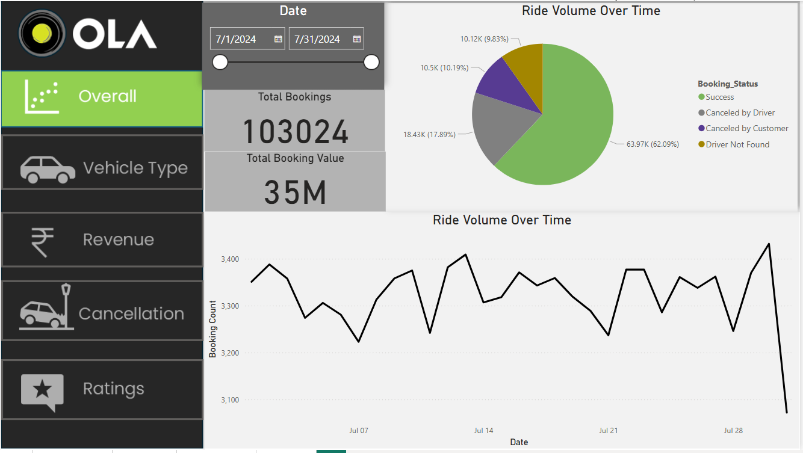

# 🚖 Ola Analytics Dashboard  

  

## 📌 Overview  
This project is an **end-to-end data analytics solution** for **Ola’s ride-sharing data**, leveraging **SQL, Excel, and Power BI** to extract insights from a **100,000-row dataset**. The dashboard provides **business intelligence** for analyzing trip patterns, driver performance, customer trends, and revenue metrics.  

## 🔄 Project Workflow  

1. **Data Extraction** → Imported raw ride data from CSV and SQL.  
2. **Data Cleaning & Transformation** → Handled missing values, duplicates, and formatting inconsistencies using SQL and Excel.  
3. **Data Analysis** → Performed **Exploratory Data Analysis (EDA)** to identify trends, patterns, and anomalies.  
4. **Data Visualization** → Created **interactive dashboards in Power BI** for key insights.  
5. **Reporting & Insights** → Generated reports to help Ola optimize business decisions.  

## 🛠️ Tools & Technologies  

- **SQL** → Data cleaning, transformation, and querying.  
- **Excel** → Data preprocessing and calculations.  
- **Power BI** → Interactive dashboards and visualizations.  

## 📊 Key Insights  

- **🚗 Peak Ride Hours** → Identified high-demand time slots to optimize driver allocation.  
- **🛣️ Popular Routes** → Analyzed frequent trip routes for business expansion.  
- **📊 Customer Segmentation** → Grouped customers based on ride frequency and fare spending.  
- **⭐ Driver Performance** → Evaluated drivers based on trip count, ratings, and revenue.  
- **💰 Payment Trends** → Assessed payment method preferences for better transaction processing.  

## 📌 Power BI Dashboard Features  

- **📈 Total Rides, Revenue, and Avg. Trip Distance Metrics**  
- **🕒 Heatmap for Ride Frequency (Time & Location)**  
- **🎯 Customer Segmentation Based on Ride Behavior**  
- **🚖 Driver Performance & Rating Analysis**  

## 📂 Repository Structure  

```
📂 Ola-Analytics-Dashboard
│── 📁 Data/                # Raw and processed datasets
│── 📁 SQL/                 # SQL queries for data cleaning & analysis
│── 📁 Excel/               # Excel files for data transformation
│── 📁 PowerBI/             # Power BI dashboard files
│── 📁 Reports/             # Final reports & insights
│── 📄 README.md            # Project documentation
```

## 🚀 How to Use  

1. **Clone the Repository**  
   ```bash
   git clone https://github.com/hamzak786/Ola-Analytics-Dashboard.git
   ```  
2. **Load the Dataset** in SQL or Excel for preprocessing.  
3. **Use Power BI** to connect to the cleaned dataset and generate visualizations.  
4. **Analyze & Interpret** insights for data-driven decision-making.  

## 👤 Contributor  

- **Mohd Hamza Khan** | [GitHub Profile](https://github.com/hamzak786)  

## 📜 License  

This project is open-source and available under the **MIT License**.  

## 🎯 Acknowledgments  

Special thanks to the data analytics community for guidance and inspiration in building this project.  

---
```

### **📝 Next Steps:**
- Make sure you **upload your dashboard image** to the repository under `PowerBI/dashboard.png` before using this link.  
- If your image is stored elsewhere, update the image link accordingly.  

Now, just copy and paste this into your **README.md** on GitHub! 🚀
